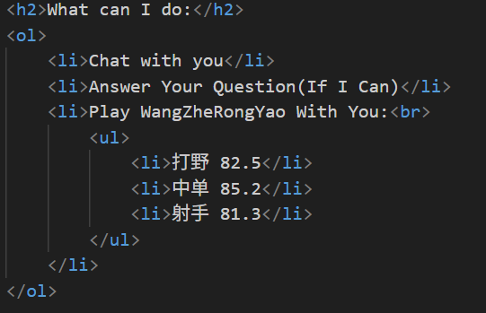
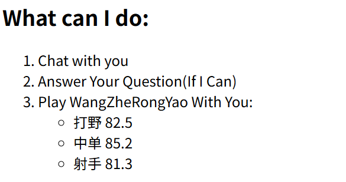
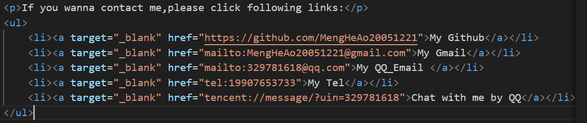
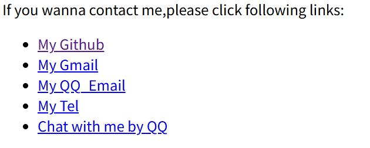
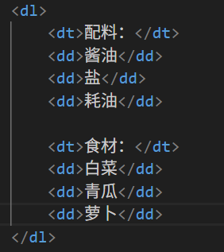
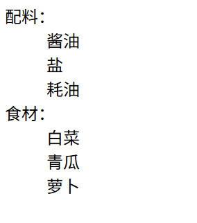

## 效果系列
### strong 加粗
### em(emphasize) 斜体
### i(italic) 斜体
### u(underlined) 下划线

## 列表系列 ol,ul,li dl,dt,dd 块级标签
### ol
Ordered List 有序列表

源代码： 
效果图： 

### ul
Unordered List 无序列表

源代码： 
效果图： 
### dl
Definition List 定义列表

源代码： 
效果图： 
